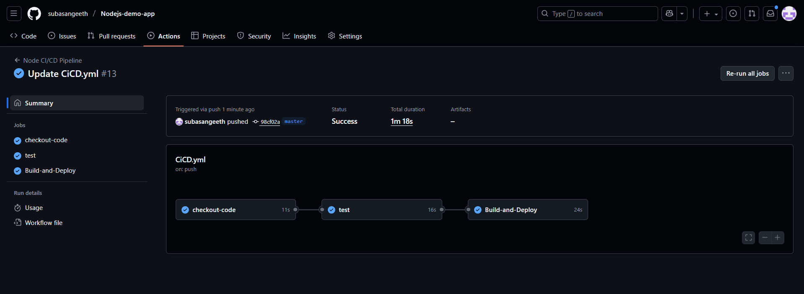
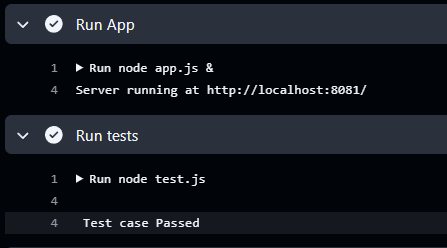
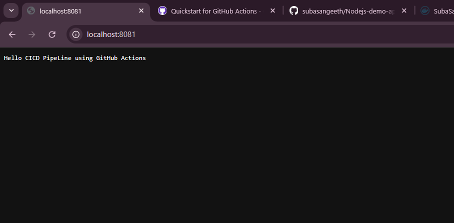
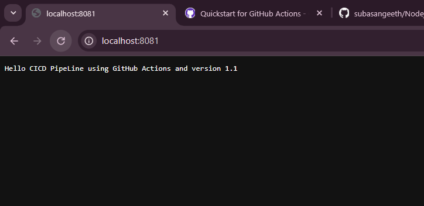
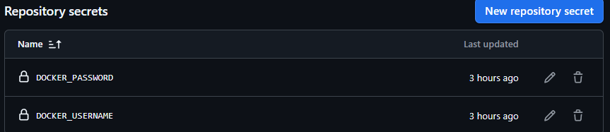

Task 1 @ELEVATE LABS

A simple Node.js web application with CI/CD pipeline using GitHub Actions and Docker.  

Flow :

    
    1. The source code is (git push) pushed to the git repository.
    2. Whenever the code pushed The GitHub Actions will do its job with our scripts which i wrote in (.github/workflow/CiCD.yml)
    3. The github actions will perform the CICD follows,
            A. Will pull the source code to machine
            B. setup nodejs and Start the nodejs app (app.js) on server
            C. the unit test case performed (test.js) if test case passed the process will continue, if TEST case failed the process will terminated.

    
                
            D. after the tests are passed the app will be BUILD the app on docker as docker image with the help of (Dockerfile).
            E. once the docker image is built it will be DEPLOY to the dockerhub (docker registry)
            F. then the image can be pulled and ran anywhere on any machines,instances on cloud.  

<====before Push=====>

<----after Push-----> push > code > test > build > pushed the new image > pulled it and excuted on my machine

Docker credentials :
Stored my docker credentials in github > Secrets
    

